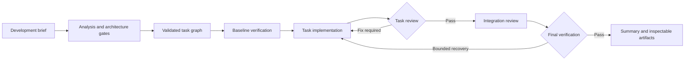

# RepoForeman

[](https://www.npmjs.com/package/repo-foreman)
[](https://github.com/sponyhub/repo-foreman/actions/workflows/ci.yml)

> A deterministic delivery pipeline and governance layer for Codex CLI.

RepoForeman turns a development brief into a structured engineering workflow: analysis, architecture, task planning, implementation, independent review, recovery, and final verification. It runs locally around `codex exec`, isolates work in Git worktrees by default, and records enough state to inspect, explain, or resume a run.

The aim is simple: make agent-assisted coding behave more like a disciplined delivery process and less like an opaque sequence of prompts whose quality depends on one conversation staying on track.

RepoForeman is an independent open-source project. It is not affiliated with, endorsed by, or supported by OpenAI. Codex and OpenAI are trademarks of their respective owner.

## Why this project exists

RepoForeman began while I was building a private software project. I needed a repeatable way to move from a rough feature request to a reviewed, tested change without relying on a single agent session to remember every decision and police its own work.

The repository-local orchestration tooling became useful beyond that one application, so I decided to extract it, remove project-specific assumptions, harden the public defaults, and make it available as an open-source project. RepoForeman contains the reusable orchestration mechanics only; it does not contain the private project's application code, data, credentials, or business logic.

## Project status

The current release is `0.1.0-beta.1`. Treat it as an early public beta:

- CLI behavior and artifact formats may change between `0.x` releases.
- macOS and Linux are the supported platforms.
- The tool is designed for trusted repositories and trusted task descriptions.
- Files under `lib/` are internal implementation details, not a stable JavaScript API.
- The canonical source repository is [sponyhub/repo-foreman](https://github.com/sponyhub/repo-foreman), and the published package is [repo-foreman on npm](https://www.npmjs.com/package/repo-foreman).
- Install prereleases explicitly from the `next` dist-tag. npm requires a bootstrap `latest` tag, so it also points to `0.1.0-beta.1`; later betas move only `next` until a stable release is approved.

## What RepoForeman adds

Coding agents are capable, and native Codex workflows already support long-running goals and delegated work. The remaining risks are usually process risks rather than a lack of model capability:

- planning decisions disappear into conversation history;
- implementation drifts away from the original acceptance criteria;
- implementation and review can share the same unexamined assumptions;
- retry and recovery decisions remain conversational instead of bounded;
- pre-existing test failures are confused with regressions;
- chat continuity does not create a repository-local, phase-aware recovery record;
- the final answer says “done” without an inspectable delivery record.

RepoForeman addresses those problems with explicit phases and deterministic gates:

- JSON Schema-validated phase outputs;
- analysis, architecture, task-graph, task, integration, and verification reviews;
- task traceability and shared-file conflict checks;
- isolated Git worktrees and opaque branch names by default;
- baseline verification before implementation begins;
- bounded worker, review, fix, replan, and verification attempts;
- resumable state with an append-only resume journal;
- run status, explanations, retry telemetry, and redacted event artifacts;
- interactive steering or autonomous execution;
- local policy presets for commands, paths, and generated diffs.

RepoForeman deliberately does **not** provide model access, authentication, a hosted service, a GitHub integration, or an operating-system security boundary.

## Why not just use Codex Goal and subagents?

[Codex Goal mode](https://learn.chatgpt.com/docs/long-running-work) is a strong default for long-running interactive work: it keeps an objective attached to a chat, continues toward its completion criteria, and supports pausing, resuming, editing, and steering. [Native Codex subagents](https://learn.chatgpt.com/docs/agent-configuration/subagents) can delegate independent exploration, implementation, testing, and review work while keeping noisy intermediate context away from the main thread.

RepoForeman does not replace either capability. It adds a deterministic delivery contract around `codex exec` for cases where the workflow itself must be inspectable and repeatable:

| Need | Native Codex | RepoForeman |
| --- | --- | --- |
| Continue a broad interactive objective | Goal tracks the outcome and keeps working toward it | Persists explicit pipeline, phase, task, and retry state on disk |
| Delegate independent work | Subagents parallelize bounded work and summarize results | Builds and validates a dependency-aware task graph before execution |
| Review a change | Review depth is directed through the prompt, agent roles, or project instructions | Runs predefined analysis, architecture, task, integration, and verification gates |
| Recover after interruption | Resume the same goal or chat context | Reconstructs a run from fingerprinted artifacts and an append-only journal |
| Control failure loops | Steer the agent or revise the goal | Enforces configured attempt, retry, diff-growth, and recovery budgets |
| Distinguish regressions | Ask the agent to inspect the existing state | Records a verification baseline before implementation and compares final results |
| Produce an audit trail | Inspect chat and agent threads | Writes schema-validated outputs, gate decisions, telemetry, and redacted local events |
| Apply repository guardrails | Use Codex sandboxing, approvals, rules, hooks, and `AGENTS.md` | Adds phase-specific sandboxing plus local command, path, and generated-diff policies |

Use native Codex directly for small, routine, highly interactive work where a chat, a clear goal, repository instructions, and optional subagents provide enough structure. It is the simpler path and usually requires fewer model calls.

Use RepoForeman when a change is broad, security-sensitive, expensive to repeat, expected to run headlessly, or needs a reproducible review and verification record. It is also useful when an interrupted run must be explainable from repository-local artifacts rather than only from conversation history.

The current beta invokes separate `codex exec` phases. It does not expose or replace the native Goal or subagent interfaces. Future releases may compose with native Codex capabilities where they improve execution without weakening RepoForeman's deterministic gates and artifact contract.

## How a run works



Every loop has a configured attempt budget. Repeated failure becomes a visible gate result instead of an infinite agent loop.

## Requirements

- Node.js `22.14.0` or newer. CI covers Node.js 22 and 24 on macOS and Linux; release verification still repeats that matrix manually.
- npm compatible with the selected Node.js release.
- Git with worktree support.
- Codex CLI installed and available as `codex`.
- An authenticated Codex session.
- A local Git repository containing the code to be changed.

Check Codex first:

```bash
codex --version
codex login status
```

Codex CLI evolves independently from RepoForeman. After installation, run `repo-foreman doctor` to check the capabilities visible to this release. A passing preflight confirms the detected CLI contract; it does not prove that arbitrary repository commands are safe or successful.

## Installation

### From a local package tarball

Use this reproducible path to install a locally packed build:

```bash
# In the RepoForeman source checkout
npm ci
npm pack

# In the repository where you want to use it
npm install --save-dev /absolute/path/to/repo-foreman-0.1.0-beta.1.tgz
npx repo-foreman doctor
```

Inspect the exact package contents before installing:

```bash
npm pack --dry-run
```

### From a source checkout

```bash
npm ci
npm link
repo-foreman doctor
```

### From npm

Beta releases use the `next` dist-tag:

```bash
# One-off
npx --yes repo-foreman@next doctor

# Global
npm install --global repo-foreman@next
repo-foreman doctor

# Repository-local
npm install --save-dev repo-foreman@next
npx repo-foreman doctor
```

Do not treat a matching package name as proof of origin. Check the npm owner, version, integrity metadata, repository link, and tarball contents.

## Quick start

Run RepoForeman from the root of a trusted Git repository:

```bash
repo-foreman doctor
repo-foreman run --task "Add validation for the account settings form"
```

For a longer or reviewable brief:

```bash
repo-foreman run --task-file ./task.md
```

Inspect an active or completed run:

```bash
repo-foreman list
repo-foreman status --run-id <run-id>
repo-foreman explain --run-id <run-id>
repo-foreman resume --run-id <run-id>
```

Start with a small, reversible task. Read the generated task graph and inspect the Git diff before merging or pushing anything.

## Execution profiles

Profiles select review depth and retry defaults. They do not relax the repository trust boundary.

| Profile | Best for | Review behavior |
| --- | --- | --- |
| `fast` | Small, routine, low-risk changes | Minimal review depth and retry budget |
| `standard` | Normal feature and maintenance work | Balanced review depth and cost |
| `strict` | Security-sensitive, broad, or high-impact changes | Deepest reviews and larger bounded recovery budget |

```bash
# Small, routine change
repo-foreman run --execution-profile fast --task-file ./task.md

# Default balance
repo-foreman run --execution-profile standard --task-file ./task.md

# Security-sensitive or broad change
repo-foreman run --execution-profile strict --task-file ./task.md
```

## Common workflows

### Plan without implementation

```bash
repo-foreman run \
  --dry-run \
  --task-file ./task.md
```

Dry-run mode stops after planning and forces agent phases to `read-only`. It still creates a local branch, worktree, and run artifacts so the plan can be inspected; it is not a zero-write command.

### Define repository-specific verification

```bash
repo-foreman run \
  --task-file ./task.md \
  --task-tests "npm test -- --runInBand" \
  --final-tests "npm run lint && npm run type-check && npm test"
```

These commands come from the repository owner. They execute through the host shell with a filtered environment but outside the Codex sandbox and command-policy path. Treat them as code: do not interpolate untrusted input, and quote paths containing shell metacharacters.

### Steer a run interactively

```bash
repo-foreman run \
  --mode interactive \
  --interaction-model conversational \
  --task-file ./task.md
```

Terminal commands include `/help`, `/status`, `/pause`, `/resume`, `/abort`, and `/replan [guidance]`. Steering is applied at supported boundaries and may interrupt and replay work. It is not guaranteed to inject text into an already running `codex exec` process.

When an owner-provided shell command is interrupted or times out on macOS or Linux, RepoForeman signals the command's process group so descendant processes do not keep the command alive.

### Configure model behavior

RepoForeman uses a quality-first default of `gpt-5.6-sol` with `xhigh` reasoning effort. It passes both settings explicitly to Codex so a run does not silently change when the operator's global Codex configuration changes. Override either value for a specific run when cost, latency, or model availability requires it:

```bash
repo-foreman run \
  --model <model-supported-by-your-codex-cli> \
  --effort <effort-supported-by-your-codex-cli> \
  --task-file ./task.md
```

The optional Codex-based semantic branch-name helper remains fixed at `low` reasoning because it only produces a short branch descriptor. For durable per-repository overrides, save `--model` and `--effort` in a repository command preset. A project or global `.codex/config.toml` still controls direct Codex sessions, but does not override RepoForeman's explicit model settings. See [Easy per-repository configuration](docs/easy-configuration.md) for a copyable setup.

## Safe defaults

RepoForeman starts from restrictive public defaults:

| Area | Default |
| --- | --- |
| Model | `gpt-5.6-sol` |
| Reasoning effort | `xhigh` for pipeline phases; `low` for semantic branch naming |
| Planning and review | Codex `read-only` sandbox |
| Implementation and repair | Codex `workspace-write` sandbox |
| Workspace network | off for child Codex executions |
| Approval policy | `on-request` |
| Web search | off unless `--search` is passed |
| Host-wide access | off; requires explicit `--unsafe-host-access` |
| Command/diff policy | `strict` |
| Policy allowlist mode | `monitor` |
| Branch naming | opaque `repo-foreman/run-<run-id>` |
| Worktree | enabled |
| Worktree dependencies | `none` |
| Environment-file copying | off |
| Event redaction | on |

Stock policies currently define no `allow_command_prefixes`. Their default `monitor` mode therefore provides deny, path, and diff controls without allowlist diagnostics. Use a custom policy to define permitted prefixes, and test it in monitor mode before enabling enforcement.

## Security and trust boundary

RepoForeman is for trusted local development work. It is **not** a safe executor for hostile repositories or hostile task descriptions.

Important limitations:

- `workspace-write` permits changes inside the selected workspace.
- Install, build, test, lint, audit, and other repository commands execute local code.
- The policy layer is defense in depth, not a complete shell parser or OS sandbox.
- Disabling Codex workspace network and web search does not prove that every subprocess is offline.
- Repository verification commands run as ordinary host processes and may have their own network behavior.
- `--unsafe-host-access` selects `danger-full-access` and materially expands the impact of mistakes or malicious instructions.
- `--no-redact` writes raw Codex event lines and can persist secrets or personal data.
- Redaction is best effort, not a data-loss-prevention system.

Do not use RepoForeman on an untrusted fork, an unreviewed archive, or a task copied from an unknown source. For higher-risk evaluation, use an ephemeral machine or container without personal credentials and enforce network restrictions outside RepoForeman.

Read [SECURITY.md](SECURITY.md) before broad or sensitive runs.

## Artifacts, privacy, and retention

Each run writes state beneath `.repo-foreman/` in the target repository:

```text
.repo-foreman/
├── runs/       # manifests, phase outputs, events, reviews, and summaries
└── worktrees/  # isolated Git worktrees created for active runs
```

Artifacts may include:

- task descriptions and follow-up answers;
- source excerpts, paths, branch names, and diffs;
- commands and bounded command output;
- model responses, assumptions, and review findings;
- failures, retry events, and verification results.

Never include secrets, tokens, customer data, or unnecessary personal information in task descriptions. Keep `.repo-foreman/` out of Git and backups unless retention is intentional. RepoForeman preserves run artifacts and registered worktrees so `status`, `explain`, and `resume` remain available; inspect them before cleanup, then remove abandoned worktrees and run data according to your own retention policy.

See [Artifacts and privacy](docs/artifacts-and-privacy.md) for cleanup and incident guidance.

## Command overview

| Command | Purpose |
| --- | --- |
| `run` | Start a new gated workflow |
| `resume` | Continue from persisted phase and task checkpoints |
| `status` | Show run state and task progress |
| `explain` | Summarize gates, failures, and diagnostics |
| `list` | List runs found in the local artifact directory |
| `doctor` | Check prerequisites and Codex CLI capabilities |
| `promote` | Evaluate completed-run retry and outcome metrics |

Run `repo-foreman help` for the options implemented by the installed build. See the full [CLI reference](docs/orchestrator-reference.md) and [configuration guide](docs/configuration.md) for option groups, precedence, policies, and retry controls.

## Cost and latency

One run can invoke Codex many times. Planning, reviews, worker attempts, recovery, branch naming, and summaries all consume model calls. The quality-first `gpt-5.6-sol`/`xhigh` default, strict profiles, large briefs, retries, and failed verification can all increase runtime and usage.

RepoForeman does not enforce a monetary budget. Before a broad run:

- split unrelated work into separate briefs;
- use the lightest profile appropriate for the risk;
- keep retry limits bounded;
- check the current pricing and limits of your Codex account;
- monitor the run instead of assuming one task equals one model call.

## Compatibility

| Component | Status |
| --- | --- |
| macOS with Node.js 22/24 | Supported; covered by CI and verified manually before release |
| Linux with Node.js 22/24 | Supported; covered by CI and verified manually before release |
| Windows native | Not supported by this release |
| WSL | Not currently supported or included in release verification |
| Codex CLI | External prerequisite; capabilities checked by `doctor` |
| Git worktrees | Required for the default isolated workflow |

## Development

```bash
npm ci
npm run check:metadata
npm test
npm run self-test
npm pack --dry-run
```

Run the complete release gate with:

```bash
npm run check
```

Pull requests and pushes to `main` run the same complete check on macOS and Linux with Node.js 22.14 and 24. The stable `Required CI` job summarizes the matrix for branch protection. CI supplements the manual release matrix; it does not authorize an npm publication.

The published runtime is designed to use only Node.js built-ins. Jest and Ajv are development-only dependencies and are not installed as runtime dependencies for consumers.

Read [CONTRIBUTING.md](CONTRIBUTING.md) before submitting a change. Report vulnerabilities through the private process in [SECURITY.md](SECURITY.md), not through a public issue.

## Documentation

- [Configuration and safe defaults](docs/configuration.md)
- [Easy per-repository configuration](docs/easy-configuration.md)
- [CLI reference](docs/orchestrator-reference.md)
- [Architecture](docs/architecture.md)
- [Artifacts and privacy](docs/artifacts-and-privacy.md)
- [Release process](docs/releasing.md)

## License

Apache License 2.0. See [LICENSE](LICENSE).
